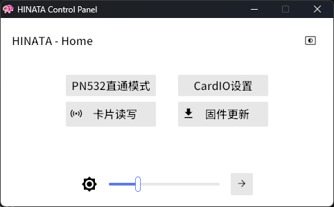

# HINATA 控制中心
**该功能仅限标准版**

## 简介
HINATA控制中心用于控制HINATA的各项设置以及写卡用，调整的设置不会存储在HINATA内，HINATA断电不会保存设置。但是控制中心会保存设置，HINATA重连回控制中心后会自动同步回上次设置。

以后会重构控制中心以及让读卡器可以持久化设置。
  
[点我下载HINATA控制中心，中国大陆用户如果下载比较慢的话可以在售后群群文件下载](https://github.com/nerimoe/HINATA-release/releases/download/HINATA-2024090300/HINATA-Control-Panel-2024050400.7z)

## 主页开关
1. PN532直通模式，可以将串口直通为PN532设备，在第三方的NFC工具中使用 （默认关闭）
2. 深色主题与亮色主题切换，在右上角
3. 底部的滑块用于调整SEGA串口模式时的亮度(AimeIO方式下亮度可以在`segatools.ini`内调整)，旁边的按钮进入设置闲置时灯光的页面
4. **控制中心内暂未实现固件更新，目前那个按钮没啥用，请使用该文档内的方法更新**

## 卡片读写

* 该页面用于读取卡片信息和把[兼容的卡片](https://s.taobao.com/search?commend=all&ie=utf8&initiative_id=tbindexz_20170306&page=1&q=m1%E7%99%BD%E5%8D%A1&search_type=item&sourceId=tb.index)写入为Aime卡
* 当放置了[兼容的卡片](https://s.taobao.com/search?commend=all&ie=utf8&initiative_id=tbindexz_20170306&page=1&q=m1%E7%99%BD%E5%8D%A1&search_type=item&sourceId=tb.index)(Mifare Classic 1k)并且该卡可写入时可以自动弹出写入框和写入按钮，可以写入20位`Access Code`用于SEGA游戏或开启了`Access Code`读取功能的CardIO
* 赠送的白色卡片也从这里写卡
* 请不要在游戏中开启卡片读写页面，否则会导致与游戏通讯出现问题

## CardIO设置

1. CardIO是用于 KONAMI游戏 以及 太鼓达人 的，如果只玩SEGA游戏的话下面可以忽略
2. UID开关：开启/关闭 对于M1卡UID读取的支持 （默认开启）
3. Access Code开关： 开启/关闭 对于旧版 Aime 卡或旧版 Aime 兼容卡的20位卡号读取的支持 （默认关闭）

### CardIO额外说明

CardIO兼容的游戏(konami游戏和太鼓达人)接收一个8字节的16进制数据，并且第一个字符必须为0

一张普通的 `Mifare Classic 1K`（M1）卡的UID有4个字节；

* 开启UID读取后，读取M1卡时会将CardIO数据的前四字节填入M1卡的UID，并且第一位会被修改为0，后面四字节全部填0
    
    例如：卡片的UID为 `11:45:14:19` 那么发送进游戏的数据将是  `01:45:14:19:00:00:00:00`
    
* Access Code开关在开启后，读取到 旧版**Aime** 时，会将20位的 Access Code转换为 8字节的16进制数据。
  例如：一张卡片的卡号是`11451419198101145141` ，当刷卡后，读卡器将会把它转换为 `0e:eb:9d:16:a4:e8:46:35` 后发给游戏
    
* 由于 旧版 Aime 卡 是M1卡片，在有`Access Code`卡号的同时也有 UID 所以
    * 当关闭Access Code开关，但开启UID开关时，会把卡片当作 普通M1卡处理，将UID发送给游戏
    * 当开启Access Code开关，但关闭UID开关时，将只会接受 旧版 Aime 卡 ，而不会接受普通的，非 Aime 的M1卡片，并将Access Code转换为16进制发送给游戏
    * 当两个开关同时开启时，刷卡时如果刷到 旧版 Aime 卡 时，会将Access Code发送给游戏，如果发现卡片并非 Aime 卡，而是普通M1卡片，则会将UID发送给游戏
    * 当两个开关都关闭时，将不接受任何 旧版 Aime 卡 和 普通M1卡片 ，只接受 Felica 卡片
* **Felica** 卡片( **Amusement IC** ，**Suica** 等 )在任何时候都可以刷，不受这两个开关控制
* 氧无面板在绑定卡号时会过滤卡号，卡号非01:2e开头的通常会被拒绝绑定