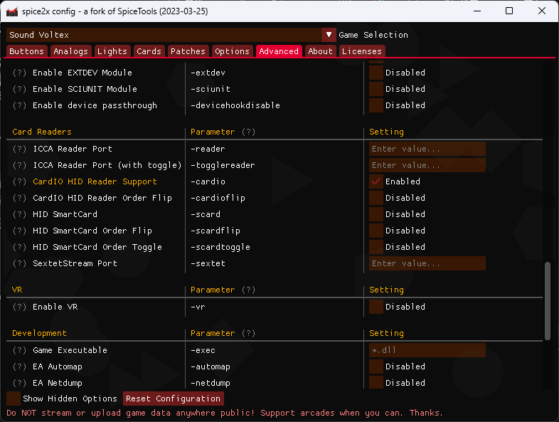
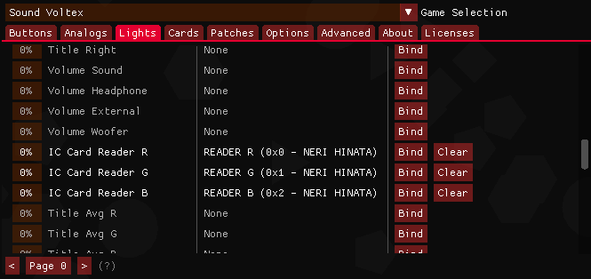

# KONAMI游戏配置说明
**该功能仅限标准版**

## CARDIO读卡设置

1. 部分较旧的固件版本需要绑定HID灯光才能进行读卡
2. 打开 *spicecfg* ，在顶部选择 **Advanced** ，找到`CardIO HID Reader Support (-cardio)`并勾选。如图所示：
   

3. 如果勾选`cardio`后读卡器不工作(可能会出现在远古版本的spice或非Windows10及以上的版本上)请尝试勾选 `HID SmartCard`
4. 如果发现刷卡的槽位不对，例如iidx这种有1p和2p的游戏，请勾选下面的 `xxx Order Flip`

## HID灯光绑定
1. 打开 *spicecfg* ，在顶部选择 **Lights**，找到 `IC Card Reader *`
2. 按下图方式绑定:
   

3. iidx之类的有2p位的游戏会分为1p 2p共六个通道，绑定你有玩的p位，或者使用两个读卡器的时候可以都绑定
4. 调整灯光亮度：在spicecfg内可以调整