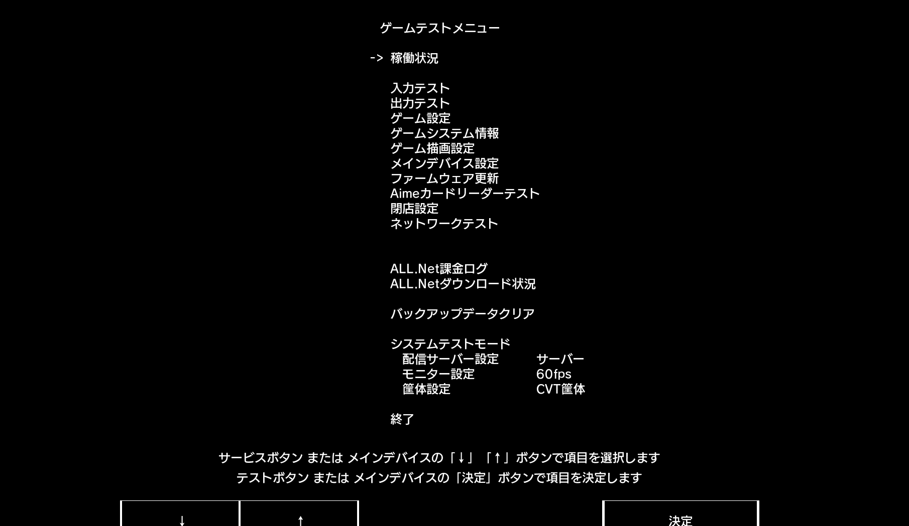
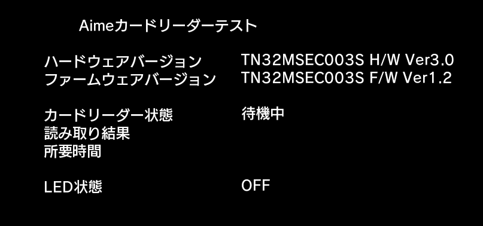

# 游戏内测试读卡器

1. 进入对应游戏的 *测试模式 (test)* 
2. 通过不同游戏的操作方式选择到 **Aimeカードリーダーテスト** 
3. 在里面可以进行**读卡测试**以及**LED测试**。segatools关闭aime的hook后如果游戏里上面两行软硬件版本号没有显示任何东西的话代表游戏并没有成功连接到读卡器

## 其他页面
* [串口方式连接游戏](serial.md)
* [AimeIO方式连接游戏](aimeio.md)
* [KONAMI游戏设置](../KONAMI/README.md)