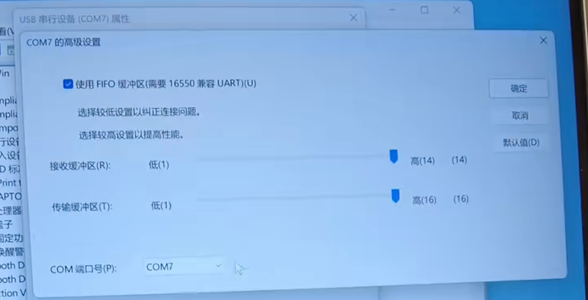

# SEGA官方串口协议连接游戏

## 食用须知
使用SEGA官方的串口读卡器协议需要关闭segatools的读卡器hook，如果关闭hook以后游戏未成功连接到读卡器（比如某些地方设置错误），游戏便会断网，需要修好后重启游戏

## 读卡器端口配置

| 游戏 | 端口号 |
| :---: | :---: |
|maimai DX | COM1 |
|ONGEKI | COM1 |
|CHUNITHM | COM4 |
1. 首先确认你游玩的游戏的端口号，并记下。以上是常用游戏的默认端口号，其他游戏如果使用amdaemon的话可以在`config_common.json`中查看
2. 
   1. 打开Windows的 *设备管理器*，默认情况下的排列方式是 按类型列出设备。
   2. 我们首先要确保对应游戏连接读卡器的端口号是否被其他设备占用。
   3. **拔掉读卡器**，找到 `端口` 下拉菜单并检查是否有设备占用端口。
   4. 如果没有看到 `端口`，可以直接进入下一步。
   5. 如果有的话，检查设备是否占用了目标端口。
   6. 如果占用了端口，需要右键该设备，并依次选择 并依次选择 `属性 → 端口设置 → 高级`
   7. 将 COM端口号 **修改为其他的端口**（比如COM255）
3. **插上读卡器**，进入下图的选单(按容器列出设备)：
   
   

4. 找到 **HINATA** 
   
   

5. 右键点击 `USB 串行设备`，并依次选择 并依次选择 `属性 → 端口设置 → 高级`
6. 将 `COM端口号` 修改为对应游戏所需要的端口号。因为读卡器使用了 *USB CDC* 类来进行串口通信，正常情况下无需修改波特率设置
7. 修改完成后需要重新插拔一次读卡器


## 游戏本体配置
1. 首先请确保你的游戏是**已经联网**的，进入游戏后能够显示一个**绿色地球图标**，否则请先把游戏的联网设置好，不在本文讨论范围内
2. 打开`segatools.ini`，并按照如下方式修改：
   ```ini
   ;如果没有[aime]条目则请手动添加该条目和条目下内容
   [aime]
   enable=0
   ;enable=0的用途是关闭掉segatools的读卡器hook，使用官方串口IO，请务必这样设置**

   ;如果有[aimeio]条目(比如使用了hinata的aimeio模式，以及mageki或nageki)
   ;在前面添加";"来注释掉，或者直接整段删掉
   [aimeio]
   ;path=hinata.dll
   ;如果有以上条目的话请务必删除
   ```
3. 因为读卡器使用了 *USB CDC* 类来进行串口通信，正常情况下无需修改波特率设置
4. 启动游戏

## 其他页面
* [AimeIO方式点我](aimeio.md)
* [游戏内测试读卡器](in_game_test.md)
* [KONAMI游戏设置]()


