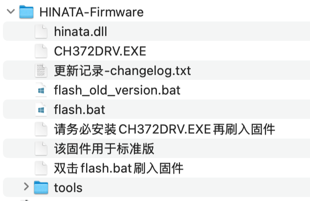

# 固件更新

* **HINATA**在发货时会预刷入发货日时最新的稳定固件，如果读卡器正常用，并且你对新功能不感兴趣的话可以不用更新
* 控制中心内暂未实现一键更新固件功能， 固件更新需要下载更新包
* **HINATA**的更新包在售后群内提供，也在 [Github](https://github.com/nerimoe/HINATA-release/releases) 上提供，**HINATA Lite**的更新包只在售后群内提供
  
## 更新方式

1. 首先解压更新包
2. 安装`CH372DRV.exe`
3. 双击`flash.bat`，并按照脚本内的提示更新固件